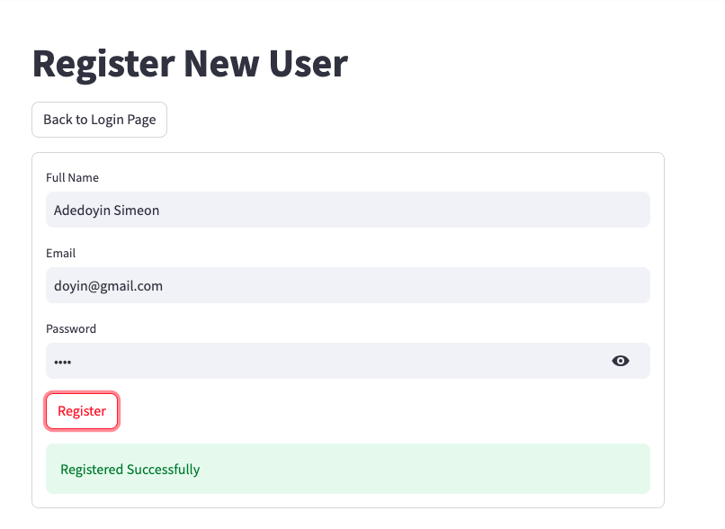
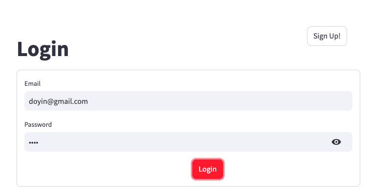
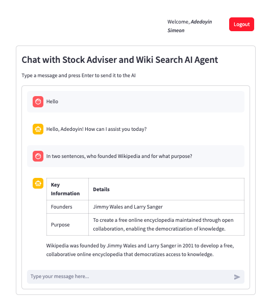
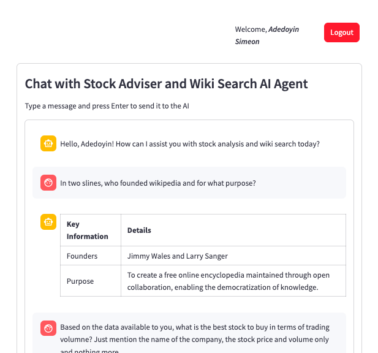

# Stock-Adviser-Wiki-AI-Agent-Client

**CLIENT**: A user-facing Streamlit `client application` for interacting with custom built Stock Adviser and Wiki Search AI Agent (built using Agno Multiagentic framework) implemented using `Streamlit`.

The demo AI Agent, implemented using [Agno Agentic Framework](https://docs.agno.com/), equiped with `yfinance` and `wikipedia` tools that can provide stock data, STOCK analysis and recommendations, and answer user queries from wikipedia knowledge base.

The Agent is provided as a `RESTful API service` implemented using `FastAPI`. See [Stock-Adviser-Wiki-AI-Agent-Server-Demo](https://github.com/SimeonDee/Stock-Adviser-Wiki-AI-Agent-Demo) repo.

## Contacts

`Adedoyin Simeon Adeyemi` | [LinkedIn](https://www.linkedin.com/in/adedoyin-adeyemi-a7827b160/)

## Tools and Tech Stack

1. `uv`: Python Package Manager, runs and installs tools published as Python packages.
2. `Streamlit`: The Client. Used to provide a simple user-facing interface for interacting with the AI Agent (backend service).
3. `requests`: For making RESTful API request to the server (AI Agent) from the client (Streamlit) App.

### Project management tools used

- `uv`: Fast and efficient package manager used for managing project dependencies.
- `Makefile`: For managing commands for creating and activating virtual envs, installing dependencies, running the app and clean-up, all in one place.

## Setup the Client App

- Clone repo
- Change into repo directory
- open terminal (Unix-based) or Command Prompt (Windows) or Powershell
- Install `uv` package manager if not already installed, using the command below:

### Install `uv` Package Manager

```bash
~ $ pip install uv
```

### Create virtual environment

```bash
~ $ make venv
```

### Activate virtual environment

- for Linux and MacOS users

```bash
~ $ make activate
```

- for Windows (Command Prompts) users

```bash
~ $ make activate-windows
```

- for Windows (PowerShell) users

```bash
~ $ make activate-windows-ps
```

### Install dependencies

```bash
(.venv) ~ $ make install
```

### Start the client (Streamlit app)

```bash
(.venv) ~ $ make run-client
```

## Teardown

### 1. Stopping the app (Streamlit)

- Navigate to the running client terminal
- Press `Cntrl` + `C` key combination to stop the client

### 2. Deactivate virtual envs

```bash
(.venv) ~ $ make deactivate
```

### 3. Clean ups (Optional)

Deletes the `.venv` and `__pycache__` directories

```bash
(.venv) ~ $ make clean
```

## Running unit tests (Optional)

```bash
(.venv) ~ $ make test
```

## Application Screenshots

- Register Screen: For new agent user registration
  

- Login Screen: For agent user login
  

- Chat Interface: For Interaction between user and the AI Agent.
  

- A Chat Session Interface: An on-going chat session between user and the AI Agent.
  
